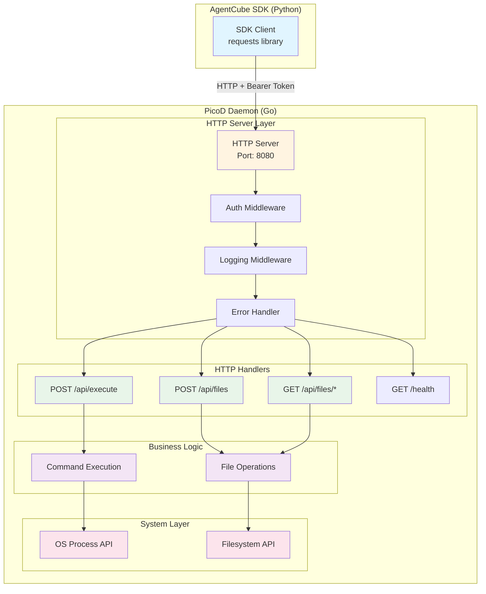
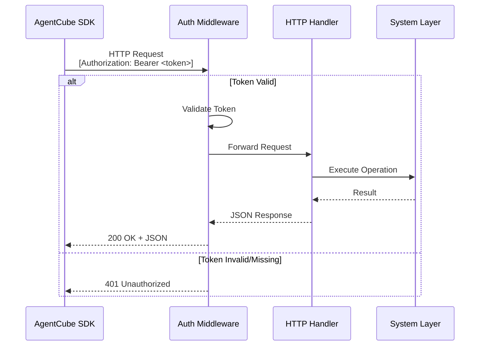

# PicoD Design Document

Author: VanderChen

## Motivation

The current AgentCube sandbox implementation relies on SSH (via `ssh_client.py`) for remote code execution, file transfer, and sandbox management. While SSH provides robust authentication and encryption, it introduces several challenges:

1. **Heavyweight Protocol**: SSH requires complex handshake procedures, key management, and session overhead
2. **Limited Customization**: SSH protocol constraints make it difficult to implement custom authentication schemes or optimize for specific use cases

To address these limitations, we propose **PicoD** (Pico Daemon) - a lightweight, HTTP-based service daemon that provides essential sandbox capabilities with minimal overhead while maintaining security through token-based authentication.

### Design Goals

PicoD is designed as a **stateless daemon** that processes individual HTTP requests independently:

- **Lightweight**: Minimal resource footprint suitable for containerized sandbox environments
- **Simple Protocol**: RESTful HTTP APIs with JSON payloads that are easy to integrate, debug, and test
- **Secure**: Token-based authentication without preset user requirements
- **Browser Compatible**: Can be accessed directly from browsers or any HTTP client
- **No Lifecycle Management**: PicoD does not manage sandbox lifecycle (creation, deletion, monitoring). These responsibilities belong to the AgentCube control plane.
- **Single Request Processing**: Each HTTP request (Execute, ReadFile, WriteFile) is handled independently without maintaining state between requests.
- **No Session Management**: No persistent connections or session state. Each request is authenticated via Authorization header.
- **Ephemeral Process**: PicoD runs for the lifetime of the sandbox container but does not track or manage the sandbox's lifecycle events.

## Use Case

PicoD enables AI agents to interact with sandboxed environments through the AgentCube SDK. The following example demonstrates a complete workflow using multiple PicoD APIs:

### Machine Learning Workflow

An AI agent performs a complete machine learning workflow - uploading data, installing dependencies, training a model, and downloading results:

```python
from agentcube import Sandbox

# Create a sandbox instance
sandbox = Sandbox(ttl=3600, image="python:3.11-slim")

# Step 1: Upload dependencies file (WriteFile API)
sandbox.write_file(
    content="pandas\nnumpy\nscikit-learn\nmatplotlib",
    remote_path="/workspace/requirements.txt"
)

# Step 2: Install dependencies (Execute API)
sandbox.execute_command("pip install -r /workspace/requirements.txt")

# Step 3: Upload training data (WriteFile API)
sandbox.upload_file(
    local_path="./data/train.csv",
    remote_path="/workspace/train.csv"
)

# Step 4: Train model (Execute API)
training_code = """
import pandas as pd
from sklearn.linear_model import LinearRegression
import pickle

df = pd.read_csv('/workspace/train.csv')
X, y = df[['feature1', 'feature2']], df['target']

model = LinearRegression().fit(X, y)
pickle.dump(model, open('/workspace/model.pkl', 'wb'))
print(f'Model R² score: {model.score(X, y):.4f}')
"""
result = sandbox.run_code("python", training_code)
print(result)

# Step 5: Download trained model (ReadFile API)
sandbox.download_file(
    remote_path="/workspace/model.pkl",
    local_path="./models/model.pkl"
)

print("Workflow completed successfully!")
```

**API Calls Flow**:

1. **POST /api/files**: Upload requirements.txt via multipart/form-data or JSON base64
2. **POST /api/execute**: Install dependencies via pip command
3. **POST /api/files**: Upload training data CSV file
4. **POST /api/execute**: Run Python training code that processes data and trains model
5. **GET /api/files/{path}**: Download trained model

All operations use standard HTTP requests with token authentication in Authorization header.

## Design Principles

PicoD follows REST API best practices for simplicity and broad compatibility:

### Architecture Patterns

- **RESTful Design**: Resource-oriented architecture with standard HTTP methods
- **JSON Payloads**: Human-readable request/response format
- **Stateless**: Each request contains all necessary information
- **Token Authentication**: Simple bearer token in Authorization header
- **Standard HTTP Status Codes**: 200 OK, 400 Bad Request, 401 Unauthorized, 404 Not Found, 500 Internal Server Error

### Core API Endpoints
1. **POST /api/execute** - Execute commands
2. **POST /api/files** - Upload files
3. **GET /api/files/{path}** - Download files
4. **GET /health** - Health check endpoint

## PicoD Architecture

### High-Level Design

#### System Architecture



#### Authentication Flow



### Component Breakdown

#### 1. HTTP Server Layer (Go Implementation)
- **Framework**: Gin (lightweight HTTP web framework)
- **Port**: Configurable (default: 8080)
- **Middleware Stack**:
  - Token authentication middleware
  - Request ID generation and logging
  - Error handling and recovery
  - CORS support (optional)
  - Metrics collection

#### 2. REST API Endpoints

**Command Execution**
- `POST /api/execute` - Execute command and return output (replaces `execute_command()`)
  - Request: JSON with command, timeout, env vars
  - Response: JSON with stdout, stderr, exit_code

**File Operations**
- `POST /api/files` - Upload file (replaces `write_file()` and `upload_file()`)
  - Request: multipart/form-data or JSON with base64 content
  - Response: JSON with file info
  
- `GET /api/files/{path}` - Download file (replaces `download_file()`)
  - Request: File path in URL
  - Response: File content with appropriate Content-Type

**Health Check**
- `GET /health` - Server health status
  - Response: JSON with status and uptime

#### 3. Authentication & Authorization

**Token-Based Authentication**

PicoD is a **stateless daemon** that handles individual HTTP requests without managing sandbox lifecycle. It uses a simple token-based authentication mechanism where the access token is passed in the HTTP Authorization header and validated by middleware for each request.

**Token Source Options for Sandbox Environments**

When PicoD runs inside a sandbox container, the access token must be securely provided at startup. Several options are available depending on the deployment environment:

##### Option 1: Kubernetes Secret Mount (Recommended for K8s)
Mount the token as a file via Kubernetes Secret:

```yaml
apiVersion: v1
kind: Pod
metadata:
  name: sandbox-pod
spec:
  containers:
  - name: picod
    image: picod:latest
    env:
    - name: PICOD_ACCESS_TOKEN_FILE
      value: /var/run/secrets/picod/token
    volumeMounts:
    - name: picod-token
      mountPath: /var/run/secrets/picod
      readOnly: true
  volumes:
  - name: picod-token
    secret:
      secretName: picod-access-token
```

**Advantages**:
- Native Kubernetes integration
- Automatic secret rotation support
- Secure storage in etcd
- RBAC-controlled access

**Implementation**: PicoD reads token from file specified by `PICOD_ACCESS_TOKEN_FILE` environment variable.

##### Option 2: Cloud-Init Injection
Inject token via cloud-init user-data for VM-based sandboxes:

```yaml
#cloud-config
write_files:
  - path: /etc/picod/token
    permissions: '0600'
    owner: root:root
    content: |
      ${PICOD_ACCESS_TOKEN}

runcmd:
  - export PICOD_ACCESS_TOKEN=$(cat /etc/picod/token)
  - /usr/local/bin/picod --port 49983
```

**Advantages**:
- Works with VM-based sandboxes (Firecracker, QEMU)
- Token available before any services start
- No external dependencies

**Use Case**: Suitable for microVM environments where Kubernetes is not available.

##### Option 3: Environment Variable (Simple Deployment)
Pass token directly as environment variable:

```bash
docker run -e PICOD_ACCESS_TOKEN=<token> picod:latest
```

**Advantages**:
- Simplest configuration
- Works with any container runtime
- No file system dependencies

**Disadvantages**:
- Token visible in process list
- Less secure for production environments

**Use Case**: Development, testing, or trusted environments.

##### Option 4: Instance Metadata Service (Cloud Provider)
Fetch token from cloud provider metadata service:

```go
// PicoD startup code
token, err := fetchTokenFromMetadata("http://169.254.169.254/latest/meta-data/picod-token")
```

**Advantages**:
- No secrets in container image or config
- Cloud-native approach
- Automatic credential management

**Use Case**: Cloud-hosted sandbox environments with instance metadata support.

**Token Configuration Priority**

PicoD checks token sources in the following order:
1. `--access-token` command-line flag (highest priority)
2. `PICOD_ACCESS_TOKEN` environment variable
3. `PICOD_ACCESS_TOKEN_FILE` environment variable (reads from file)
4. `/etc/picod/token` default file location
5. Instance metadata service (if configured)

**Token Validation**

All HTTP requests must include the token in the Authorization header:
```
Authorization: Bearer <access_token>
```

The auth middleware validates the token on every request. Since PicoD is stateless, there is no session management or token caching beyond the initial startup configuration.

#### 4. Core Capabilities

##### Code Execution
Replaces SSH's `exec_command()`:

**Endpoint**: `POST /api/execute`

**Request Body** (JSON):
```json
{
  "command": "echo 'Hello World'",
  "timeout": 30,
  "working_dir": "/workspace",
  "env": {
    "VAR1": "value1",
    "VAR2": "value2"
  }
}
```

**Response** (JSON):
```json
{
  "stdout": "Hello World\n",
  "stderr": "",
  "exit_code": 0,
  "duration": 0.12
}
```

**Error Response** (401/400/500):
```json
{
  "error": "Unauthorized: invalid token",
  "code": 401
}
```

##### File Transfer

**Upload File** (replaces `write_file()` and `upload_file()`):

**Endpoint**: `POST /api/files`

**Option 1: Multipart Form Data** (recommended for binary files)
```http
POST /api/files HTTP/1.1
Content-Type: multipart/form-data; boundary=----WebKitFormBoundary
Authorization: Bearer <token>

------WebKitFormBoundary
Content-Disposition: form-data; name="path"

/workspace/test.txt
------WebKitFormBoundary
Content-Disposition: form-data; name="file"; filename="test.txt"
Content-Type: text/plain

[file content]
------WebKitFormBoundary
Content-Disposition: form-data; name="mode"

0644
------WebKitFormBoundary--
```

**Option 2: JSON with Base64** (for text files or API convenience)
```json
{
  "path": "/workspace/test.txt",
  "content": "SGVsbG8gV29ybGQ=",
  "mode": "0644"
}
```

**Response**:
```json
{
  "path": "/workspace/test.txt",
  "size": 1024,
  "mode": "0644",
  "modified": "2025-11-18T10:30:00Z"
}
```

**Download File** (replaces `download_file()`):

**Endpoint**: `GET /api/files/{path}`

**Request**:
```http
GET /api/files/workspace/test.txt HTTP/1.1
Authorization: Bearer <token>
```

**Response**:
```http
HTTP/1.1 200 OK
Content-Type: text/plain
Content-Length: 1024
Content-Disposition: attachment; filename="test.txt"

[file content]
```

For binary files, appropriate `Content-Type` is set (e.g., `application/octet-stream`, `image/png`)


## Python SDK Interface

### PicoDClient Class

The Python SDK provides a simple interface for interacting with PicoD:

```python
import requests
from typing import Dict, List, Optional

class PicoDClient:
    """Client for interacting with PicoD daemon via REST API"""
    
    def __init__(self, host: str, port: int = 8080, access_token: str):
        """Initialize PicoD client with connection parameters"""
        self.base_url = f"http://{host}:{port}"
        self.headers = {
            "Authorization": f"Bearer {access_token}",
            "Content-Type": "application/json"
        }
        
    def execute_command(self, command: str, timeout: float = 30, 
                       working_dir: Optional[str] = None,
                       env: Optional[Dict[str, str]] = None) -> str:
        """Execute a command and return stdout"""
        response = requests.post(
            f"{self.base_url}/api/execute",
            headers=self.headers,
            json={
                "command": command,
                "timeout": timeout,
                "working_dir": working_dir,
                "env": env or {}
            }
        )
        response.raise_for_status()
        result = response.json()
        if result["exit_code"] != 0:
            raise Exception(f"Command failed: {result['stderr']}")
        return result["stdout"]
        
    def execute_commands(self, commands: List[str]) -> Dict[str, str]:
        """Execute multiple commands"""
        results = {}
        for cmd in commands:
            results[cmd] = self.execute_command(cmd)
        return results
        
    def run_code(self, language: str, code: str, timeout: float = 30) -> str:
        """Run code snippet in specified language"""
        if language.lower() in ["python", "py", "python3"]:
            command = f"python3 -c {shlex.quote(code)}"
        elif language.lower() in ["bash", "sh", "shell"]:
            command = f"bash -c {shlex.quote(code)}"
        else:
            raise ValueError(f"Unsupported language: {language}")
        return self.execute_command(command, timeout)
        
    def write_file(self, content: str, remote_path: str, mode: Optional[str] = None) -> None:
        """Write content to remote file (uses JSON/base64)"""
        import base64
        content_b64 = base64.b64encode(content.encode()).decode()
        response = requests.post(
            f"{self.base_url}/api/files",
            headers=self.headers,
            json={
                "path": remote_path,
                "content": content_b64,
                "mode": mode or "0644"
            }
        )
        response.raise_for_status()
        
    def upload_file(self, local_path: str, remote_path: str, mode: Optional[str] = None) -> None:
        """Upload local file to remote server (uses multipart/form-data)"""
        with open(local_path, 'rb') as f:
            files = {'file': f}
            data = {'path': remote_path}
            if mode:
                data['mode'] = mode
            headers = {"Authorization": self.headers["Authorization"]}
            response = requests.post(
                f"{self.base_url}/api/files",
                headers=headers,
                files=files,
                data=data
            )
            response.raise_for_status()
        
    def download_file(self, remote_path: str, local_path: str) -> None:
        """Download remote file to local path"""
        response = requests.get(
            f"{self.base_url}/api/files/{remote_path}",
            headers={"Authorization": self.headers["Authorization"]},
            stream=True
        )
        response.raise_for_status()
        
        os.makedirs(os.path.dirname(local_path) or '.', exist_ok=True)
        with open(local_path, 'wb') as f:
            for chunk in response.iter_content(chunk_size=8192):
                f.write(chunk)
    
    def health_check(self) -> Dict:
        """Check server health"""
        response = requests.get(f"{self.base_url}/health")
        response.raise_for_status()
        return response.json()
```

## Security Considerations

1. **Token Management**:
   - Access tokens generated per sandbox instance by AgentCube API server
   - Tokens stored securely in memory only within PicoD
   - Token provided at PicoD startup via one of the configured sources
   - No token rotation needed (PicoD lifecycle matches sandbox lifecycle)

2. **File Access Control**:
   - Path sanitization to prevent directory traversal attacks
   - User-based permission checks enforced by OS
   - No arbitrary file system access outside sandbox boundaries

3. **Process Isolation**:
   - Processes run with sandbox user privileges
   - Resource limits enforced via container runtime (cgroups)
   - No privilege escalation mechanisms

4. **Network Security**:
   - PicoD listens on all interfaces (0.0.0.0) within sandbox network namespace
   - Network isolation provided by container/pod networking
   - Token authentication required for all operations
   - Optional TLS support for production deployments


## Future Enhancements

1. **WebSocket Support**: Real-time bidirectional communication for interactive shells
2. **Compression**: Gzip compression for file transfers
3. **Multiplexing**: Multiple operations over single connection
4. **Metrics Export**: Prometheus-compatible metrics endpoint
5. **Plugin System**: Custom handlers for domain-specific operations
6. **TLS/mTLS**: Encrypted communication for production environments

## Conclusion

PicoD provides a lightweight, efficient alternative to SSH for sandbox management in AgentCube. By leveraging RESTful HTTP APIs with JSON payloads and token-based authentication, it reduces resource overhead while maintaining security and functionality. The REST API design ensures:

- **Easy Integration**: Compatible with any HTTP client (curl, Postman, requests, axios, etc.)
- **Human Readable**: JSON format is easy to debug and understand
- **Broad Compatibility**: Works with browsers, mobile apps, and all programming languages
- **Simple Testing**: No need for specialized tools like grpcurl

The design ensures seamless integration with existing AgentCube infrastructure and provides a clear migration path from the current SSH-based implementation.
