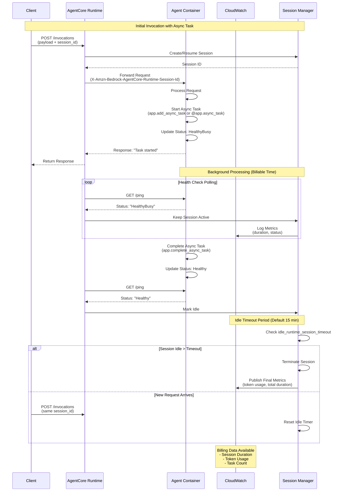
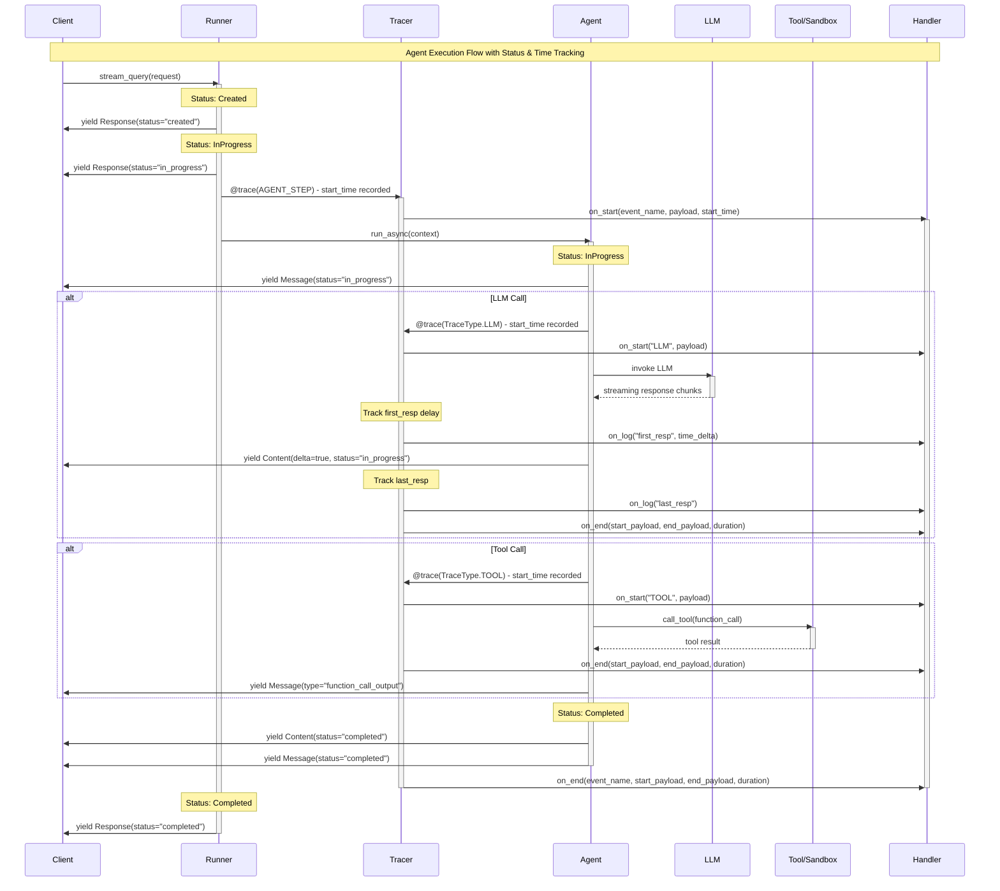

# AgentCore
Based on my analysis of the codebase, AgentCore tracks agent running state and manages billing through a combination of health status monitoring, session lifecycle management, and observability metrics. Here's a comprehensive explanation with a sequence diagram:

## Agent State Tracking

AgentCore tracks agent running state through three key mechanisms:

1. **Health Status via /ping Endpoint**: Agents report their status as either "Healthy" (idle, ready for work) or "HealthyBusy" (actively processing background tasks). [1](#2-0) 

2. **Session Lifecycle Management**: Sessions have configurable timeouts including `idle_runtime_session_timeout` (for idle sessions) and `max_lifetime` (maximum runtime regardless of activity), both ranging from 60-28800 seconds. [2](#2-1) 

3. **Async Task Tracking**: The toolkit provides three approaches for managing asynchronous tasks, each automatically updating the health status:
   - `@app.async_task` decorator (recommended, automatic)
   - Manual task management with `add_async_task()` and `complete_async_task()`
   - Custom `@app.ping` handler with custom logic [3](#2-2) 

## Billing Management

While AgentCore doesn't directly calculate billing costs, it provides comprehensive tracking mechanisms:

1. **CloudWatch Metrics**: The system publishes metrics to the `bedrock-agentcore` namespace, including token usage, session count, latency, and duration metrics. [4](#2-3) 

2. **Session Duration Tracking**: Sessions are automatically tracked with a default 15-minute idle timeout, and the session ID is persisted across invocations. [5](#2-4) 

3. **Lifecycle Configuration**: Custom lifecycle settings control when sessions terminate, directly impacting billable runtime. [6](#2-5) 

## Sequence Diagram

Here's how AgentCore tracks state and manages billing for asynchronous tool calls:



## Key Implementation Details

**Invocation Flow**: When a client invokes an agent, the request includes a `session_id` that is passed via headers. The `BedrockAgentCoreClient` uses `runtimeSessionId` in the boto3 API call, while `HttpBedrockAgentCoreClient` uses the `X-Amzn-Bedrock-AgentCore-Runtime-Session-Id` header. [7](#2-6) [8](#2-7) 

**Manual Async Task Management**: Developers can manually track tasks using the API, where calling `add_async_task()` returns a task_id and automatically changes status to "HealthyBusy", then `complete_async_task()` marks completion and returns to "Healthy". [9](#2-8) 

**Session Persistence**: The session ID is automatically saved to the configuration file and reused across invocations unless explicitly changed. [10](#2-9) 

## Notes

- **No Direct Cost Calculation**: The toolkit focuses on state tracking and metrics collection rather than calculating actual billing costs. Cost analysis requires external AWS pricing information for both CloudWatch metrics and foundation model API calls.

- **Observability Integration**: AgentCore automatically instruments agents with OpenTelemetry when deployed via Runtime, publishing traces and metrics to CloudWatch without additional code changes. [11](#2-10) 

- **Ping Status Priority**: When determining health status, the system checks in order: forced status (debug mode), custom handler, then automatic status based on active async tasks. [12](#2-11)

### Citations

**File:** documentation/docs/user-guide/runtime/async.md (L20-24)
```markdown
Agent code communicates its processing status using the "/ping" health status:

- **"Healthy"**: Ready for new work, no background tasks running
- **"HealthyBusy"**: Currently processing background tasks

```

**File:** documentation/docs/user-guide/runtime/async.md (L25-25)
```markdown
A session in idle state for 15 minutes gets automatically terminated.
```

**File:** documentation/docs/user-guide/runtime/async.md (L29-56)
```markdown
### 1. Async Task Decorator (Recommended)

The simplest way to track asynchronous functions. The SDK automatically manages the ping status:

```python
from bedrock_agentcore import BedrockAgentCoreApp

app = BedrockAgentCoreApp()

@app.async_task
async def background_work():
    await asyncio.sleep(10)  # Status becomes "HealthyBusy"
    return "done"

@app.entrypoint
async def handler(event):
    asyncio.create_task(background_work())
    return {"status": "started"}

if __name__ == "__main__":
    app.run()
```

**How it works:**
- The `@app.async_task` decorator tracks function execution
- When the function runs, ping status changes to "HealthyBusy"
- When the function completes, status returns to "Healthy"

```

**File:** documentation/docs/user-guide/runtime/async.md (L58-91)
```markdown

For more control over task tracking, use the API methods directly:

```python
from bedrock_agentcore import BedrockAgentCoreApp
import threading
import time

app = BedrockAgentCoreApp()

@app.entrypoint
def handler(event):
    """Start tracking a task manually"""
    # Start tracking the task
    task_id = app.add_async_task("data_processing", {"batch": 100})

    # Start background work
    def background_work():
        time.sleep(30)  # Simulate work
        app.complete_async_task(task_id)  # Mark as complete

    threading.Thread(target=background_work, daemon=True).start()

    return {"status": "Task started", "task_id": task_id}

if __name__ == "__main__":
    app.run()
```

**API Methods:**
- `app.add_async_task(name, metadata)` - Start tracking a task
- `app.complete_async_task(task_id)` - Mark task as complete
- `app.get_async_task_info()` - Get information about running tasks

```

**File:** documentation/docs/user-guide/runtime/async.md (L175-182)
```markdown
## Ping Status Priority

The ping status is determined in this priority order:

1. **Forced Status** (debug actions like `force_busy`)
2. **Custom Handler** (`@app.ping` decorator)
3. **Automatic** (based on active `@app.async_task` functions)

```

**File:** src/bedrock_agentcore_starter_toolkit/utils/runtime/schema.py (L105-113)
```python
    idle_runtime_session_timeout: Optional[int] = Field(
        default=None,
        description="Timeout in seconds for idle runtime sessions (60-28800)",
        ge=60,
        le=28800,
    )
    max_lifetime: Optional[int] = Field(
        default=None, description="Maximum lifetime for the instance in seconds (60-28800)", ge=60, le=28800
    )
```

**File:** documentation/docs/user-guide/observability/quickstart.md (L7-14)
```markdown
AgentCore Observability provides:

- Detailed visualizations of each step in the agent workflow
- Real-time visibility into operational performance through CloudWatch dashboards
- Telemetry for key metrics such as session count, latency, duration, token usage, and error rates
- Rich metadata tagging and filtering for issue investigation
- Standardized OpenTelemetry (OTEL)-compatible format for easy integration with existing monitoring stacks
- Flexibility to be used with all AI agent frameworks and any large language model
```

**File:** documentation/docs/user-guide/observability/quickstart.md (L71-76)
```markdown
## Enabling Observability for AgentCore Runtime hosted Agents

AgentCore Runtime-hosted agents are deployed and executed directly within the AgentCore environment, providing automatic instrumentation with minimal configuration. This approach offers the fastest path to deployment and is ideal for rapid development and testing.

For a complete example please refer to this [notebook](https://github.com/awslabs/amazon-bedrock-agentcore-samples/blob/main/01-tutorials/06-AgentCore-observability/01-Agentcore-runtime-hosted/runtime_with_strands_and_bedrock_models.ipynb)

```

**File:** src/bedrock_agentcore_starter_toolkit/operations/runtime/status.py (L67-69)
```python
    if agent_config.aws.lifecycle_configuration.has_custom_settings:
        config_info.idle_timeout = agent_config.aws.lifecycle_configuration.idle_runtime_session_timeout
        config_info.max_lifetime = agent_config.aws.lifecycle_configuration.max_lifetime
```

**File:** src/bedrock_agentcore_starter_toolkit/services/runtime.py (L465-470)
```python
        req = {
            "agentRuntimeArn": agent_arn,
            "qualifier": endpoint_name,
            "runtimeSessionId": session_id,
            "payload": payload,
        }
```

**File:** src/bedrock_agentcore_starter_toolkit/services/runtime.py (L573-577)
```python
        headers = {
            "Authorization": f"Bearer {bearer_token}",
            "Content-Type": "application/json",
            "X-Amzn-Bedrock-AgentCore-Runtime-Session-Id": session_id,
        }
```

**File:** src/bedrock_agentcore_starter_toolkit/operations/runtime/invoke.py (L44-55)
```python
    # Handle session ID
    if not session_id:
        session_id = agent_config.bedrock_agentcore.agent_session_id
        if not session_id:
            session_id = generate_session_id()

    # Save session ID for reuse
    agent_config.bedrock_agentcore.agent_session_id = session_id

    # Update project config and save
    project_config.agents[agent_config.name] = agent_config
    save_config(project_config, config_path)
```

# AgentScope

### Answer
Based on my analysis of the agentscope-runtime codebase, here's a comprehensive Mermaid sequence diagram representing the agent execution flow with status transitions and time tracking:



## Key Components and Citations

### Status Transitions

The status flow follows the `RunStatus` enum which defines all possible states: agentscope-runtime:60-73 

The `Event` class provides methods for transitioning between statuses: agentscope-runtime:175-216 

### Time Tracking Implementation

Time tracking starts when the `Tracer.event()` context manager is entered: agentscope-runtime:188-239 

The duration is calculated when handlers process the `on_end` event: agentscope-runtime:108-129 

### LLM Call Tracking

The `@trace` decorator captures timing for LLM calls, recording first response delay and final output: agentscope-runtime:707-729 

For streaming responses, only the first and last chunks are logged to avoid redundancy: agentscope-runtime:418-447 

### Tool Call Tracking

Tool calls are tracked using the same `@trace` decorator with `TraceType.TOOL`: agentscope-runtime:13-15 

### Agent Execution Flow

The `Runner.stream_query()` method orchestrates the entire flow with `@trace(TraceType.AGENT_STEP)`: agentscope-runtime:135-147 

The response status transitions through the execution lifecycle: agentscope-runtime:156-235 

## Notes

The diagram shows the complete execution flow including:
- **Status transitions**: Following the lifecycle from `created` → `in_progress` → `completed` (or `failed`/`canceled`/`rejected`)
- **Time tracking**: Implemented via the OpenTelemetry-based tracing system that records `start_time` and calculates duration in the `on_end` handler
- **LLM tracking**: Special handling for streaming responses with first response delay (`gen_ai.response.first_delay`) and merge operations
- **Tool tracking**: Each tool execution is wrapped in its own trace span with timing information

The tracing system uses handlers (like `LocalLogHandler`) to process events, and all timing is calculated as `time.time() - start_time` in seconds. The system supports both synchronous and asynchronous execution patterns with appropriate time tracking for each.
### Citations
**File:** src/agentscope_runtime/engine/schemas/agent_schemas.py (L60-73)
```python
class RunStatus:
    """
    Enum class for agent event message.
    """

    Created = "created"
    InProgress = "in_progress"
    Completed = "completed"
    Canceled = "canceled"
    Failed = "failed"
    Rejected = "rejected"
    Unknown = "unknown"
    Queued = "queued"
    Incomplete = "incomplete"
```
**File:** src/agentscope_runtime/engine/schemas/agent_schemas.py (L175-216)
```python
    def created(self) -> Self:
        """
        Set the message status to 'created'.
        """
        self.status = RunStatus.Created
        return self

    def in_progress(self) -> Self:
        """
        Set the message status to 'in_progress'.
        """
        self.status = RunStatus.InProgress
        return self

    def completed(self) -> Self:
        """
        Set the message status to 'completed'.
        """
        self.status = RunStatus.Completed
        return self

    def failed(self, error: Error) -> Self:
        """
        Set the message status to 'failed'.
        """
        self.status = RunStatus.Failed
        self.error = error
        return self

    def rejected(self) -> Self:
        """
        Set the message status to 'rejected'.
        """
        self.status = RunStatus.Rejected
        return self

    def canceled(self) -> Self:
        """
        Set the message status to 'canceled'.
        """
        self.status = RunStatus.Canceled
        return self
```
**File:** src/agentscope_runtime/engine/tracing/base.py (L108-129)
```python
    def on_end(
        self,
        event_name: str,
        start_payload: Dict[str, Any],
        end_payload: Dict[str, Any],
        start_time: float,
        **kwargs: Any,
    ) -> None:
        """Log the end of a trace event.

        Args:
            event_name (str): The name of event being traced.
            start_payload (Dict[str, Any]): The payload data from event start.
            end_payload (Dict[str, Any]): The payload data from event end.
            start_time (float): The timestamp when the event started.
            **kwargs (Any): Additional keyword arguments.
        """
        self.logger.info(
            f"Event {event_name} ended with start payload: {start_payload}, "
            f"end payload: {end_payload}, duration: "
            f"{time.time() - start_time} seconds, kwargs: {kwargs}",
        )
```
**File:** src/agentscope_runtime/engine/tracing/base.py (L188-239)
```python
    @contextmanager
    def event(
        self,
        span: Any,
        event_name: str,
        payload: Dict[str, Any],
        **kwargs: Any,
    ) -> Any:
        """Create a context manager for tracing an event.

        Args:
            span(Any): span of event
            event_name (str): The name of event being traced.
            payload (Dict[str, Any]): The payload data for the event.
            **kwargs (Any): Additional keyword arguments.

        Yields:
            EventContext: The event context for logging and managing the trace.
        """
        start_time = time.time()

        for handle in self.handlers:
            handle.on_start(
                event_name,
                payload,
                **kwargs,
            )

        event_context = EventContext(
            span,
            self.handlers,
            event_name,
            start_time,
            payload,
        )

        try:
            yield event_context
        except Exception as e:
            traceback_info = traceback.format_exc()
            for handle in self.handlers:
                handle.on_error(
                    event_name,
                    payload,
                    e,
                    start_time,
                    traceback_info=traceback_info,
                )
            raise

        event_context.finalize(payload)

```
**File:** src/agentscope_runtime/engine/tracing/wrapper.py (L418-447)
```python
                            start_time = int(time.time() * 1000)
                            async for i, resp in aenumerate(
                                func(*args, **func_kwargs),
                            ):  # type: ignore
                                yield resp
                                cumulated.append(resp)

                                if i == 0:
                                    _trace_first_resp(
                                        resp,
                                        event,
                                        span,
                                        start_time,
                                    )

                                if get_finish_reason_func is not None:
                                    _trace_last_resp(
                                        resp,
                                        get_finish_reason_func,
                                        event,
                                        span,
                                    )

                            if cumulated and merge_output_func is not None:
                                _trace_merged_resp(
                                    cumulated,
                                    merge_output_func,
                                    event,
                                    span,
                                )
```
**File:** src/agentscope_runtime/engine/tracing/wrapper.py (L707-729)
```python
def _trace_first_resp(
    resp: Any,
    event: EventContext,
    span: Any,
    start_time: int,
) -> None:
    payload = _obj_to_dict(resp)
    event.on_log(
        "",
        **{
            "step_suffix": "first_resp",
            "payload": payload,
        },
    )
    span.set_attribute(
        "gen_ai.response.first_delay",
        int(time.time() * 1000) - start_time,
    )
    _, output_value = _get_ot_type_and_value(payload)
    span.set_attribute(
        "gen_ai.response.first_pkg",
        output_value,
    )
```
**File:** src/agentscope_runtime/engine/tracing/tracing_metric.py (L13-15)
```python
    LLM = "LLM"
    TOOL = "TOOL"
    AGENT_STEP = "AGENT_STEP"
```
**File:** src/agentscope_runtime/engine/runner.py (L135-147)
```python
    @trace(
        TraceType.AGENT_STEP,
        trace_name="agent_step",
        merge_output_func=merge_agent_response,
        get_finish_reason_func=get_agent_response_finish_reason,
    )
    async def stream_query(  # pylint:disable=unused-argument
        self,
        request: Union[AgentRequest, dict],
        user_id: Optional[str] = None,
        tools: Optional[List] = None,
        **kwargs: Any,
    ) -> AsyncGenerator[Event, None]:
```
**File:** src/agentscope_runtime/engine/runner.py (L156-235)
```python
        # Initial response
        response = AgentResponse()
        yield seq_gen.yield_with_sequence(response)

        # Set to in-progress status
        response.in_progress()
        yield seq_gen.yield_with_sequence(response)

        if user_id is None:
            if getattr(request, "user_id", None):
                user_id = request.user_id
            else:
                user_id = ""  # Default user id

        session_id = request.session_id or str(uuid.uuid4())
        request_input = request.input

        # TODO: `compose_session` will be removed in v1.0
        session = await self._context_manager.compose_session(
            user_id=user_id,
            session_id=session_id,
        )

        context = Context(
            user_id=session.user_id,
            session=session,
            request=request,
            current_messages=request_input,
            context_manager=self._context_manager,
            environment_manager=self._environment_manager,
            agent=self._agent,
        )

        # TODO: Update activate tools into the context (not schema only)
        tools = tools or getattr(self._agent, "tools", None)
        if tools:
            # Lazy import
            from ..sandbox.tools.utils import setup_tools

            activated_tools, schemas = setup_tools(
                tools=tools,
                environment_manager=context.environment_manager,
                session_id=session.id,
                user_id=session.user_id,
                include_schemas=True,
            )

            # update the context
            context.activate_tools = activated_tools

            # convert schema to a function call tool lists
            # TODO: use pydantic model
            if hasattr(context.request, "tools") and context.request.tools:
                context.request.tools.extend(schemas)

        # update message in session
        # TODO: remove this after refactoring all agents
        from .agents.agentscope_agent import AgentScopeAgent

        if not isinstance(self._agent, AgentScopeAgent):
            await context.context_manager.compose_context(
                session=context.session,
                request_input=request_input,
            )

        async for event in self._agent.run_async(context):
            if (
                event.status == RunStatus.Completed
                and event.object == "message"
            ):
                response.add_new_message(event)
            yield seq_gen.yield_with_sequence(event)

        # TODO: remove this after refactoring all agents
        if not isinstance(self._agent, AgentScopeAgent):
            await context.context_manager.append(
                session=context.session,
                event_output=response.output,
            )
        yield seq_gen.yield_with_sequence(response.completed())

```

# How `agentcore.configure` Works and the Protocol Option

## Overview

`agentcore.configure` is the configuration command that sets up your Bedrock AgentCore agent before deployment. It creates a `.bedrock_agentcore.yaml` configuration file that stores all deployment settings for your agent. [1](#3-0) 

## The Protocol Option

The `protocol` option accepts one of three values: **HTTP**, **MCP**, or **A2A**. This option is validated during configuration to ensure it's one of these supported protocols: [2](#3-1) 

The protocol is stored in a `ProtocolConfiguration` object with validation: [3](#3-2) 

## Why Protocol is Required

The protocol option is required because **each protocol uses a different port and mount path**, and the Bedrock AgentCore service needs to know how to route requests to your container:

### The Three Protocols

1. **HTTP Protocol**: 
   - Port: 8080
   - Mount path: `/invocations`
   - Traditional HTTP-based agent communication

2. **MCP Protocol** (Model Context Protocol):
   - Port: 8000
   - Mount path: `/mcp`
   - Protocol for model-context communication

3. **A2A Protocol** (Agent-to-Agent):
   - Port: 9000
   - Mount path: `/` (root)
   - Uses JSON-RPC for agent-to-agent communication
   - Supports built-in agent discovery through Agent Cards [4](#3-3) 

All three ports are exposed in the Docker container to support any protocol choice: [5](#3-4) 

## How Protocol is Used During Deployment

During the `launch` phase, the protocol configuration is converted to AWS API format and passed to the Bedrock AgentCore service when creating or updating the agent: [6](#3-5) 

The protocol configuration is then included in the `create_agent` API call: [7](#3-6) 

## Configuration Methods

You can set the protocol through:

1. **CLI**: `agentcore configure --entrypoint agent.py --protocol A2A`
2. **Python SDK**: `runtime.configure(entrypoint='agent.py', protocol='HTTP')` [8](#3-7) [9](#3-8) 

## Default Behavior

If no protocol is specified, the system defaults to **HTTP**: [10](#3-9) 

## Notes

- The protocol choice is **immutable after agent creation** - you cannot change the protocol for an existing agent
- The protocol determines how clients interact with your agent and which port/path they should use
- Each protocol has different use cases: HTTP for standard agents, MCP for model-context communication, and A2A for agent-to-agent interactions with built-in discovery mechanisms

### Citations

**File:** src/bedrock_agentcore_starter_toolkit/operations/runtime/configure.py (L130-186)
```python
def configure_bedrock_agentcore(
    agent_name: str,
    entrypoint_path: Path,
    execution_role: Optional[str] = None,
    code_build_execution_role: Optional[str] = None,
    ecr_repository: Optional[str] = None,
    container_runtime: Optional[str] = None,
    auto_create_ecr: bool = True,
    auto_create_execution_role: bool = True,
    enable_observability: bool = True,
    memory_mode: Literal["NO_MEMORY", "STM_ONLY", "STM_AND_LTM"] = "NO_MEMORY",
    requirements_file: Optional[str] = None,
    authorizer_configuration: Optional[Dict[str, Any]] = None,
    request_header_configuration: Optional[Dict[str, Any]] = None,
    verbose: bool = False,
    region: Optional[str] = None,
    protocol: Optional[str] = None,
    non_interactive: bool = False,
    source_path: Optional[str] = None,
    vpc_enabled: bool = False,
    vpc_subnets: Optional[List[str]] = None,
    vpc_security_groups: Optional[List[str]] = None,
    idle_timeout: Optional[int] = None,
    max_lifetime: Optional[int] = None,
) -> ConfigureResult:
    """Configure Bedrock AgentCore application with deployment settings.

    Args:
        agent_name: name of the agent,
        entrypoint_path: Path to the entrypoint file
        execution_role: AWS execution role ARN or name (auto-created if not provided)
        code_build_execution_role: CodeBuild execution role ARN or name (uses execution_role if not provided)
        ecr_repository: ECR repository URI
        container_runtime: Container runtime to use
        auto_create_ecr: Whether to auto-create ECR repository
        auto_create_execution_role: Whether to auto-create execution role if not provided
        enable_observability: Whether to enable observability
        memory_mode: Memory configuration mode - "NO_MEMORY", "STM_ONLY" (default), or "STM_AND_LTM"
        requirements_file: Path to requirements file
        authorizer_configuration: JWT authorizer configuration dictionary
        request_header_configuration: Request header configuration dictionary
        verbose: Whether to provide verbose output during configuration
        region: AWS region for deployment
        protocol: agent server protocol, must be either HTTP or MCP or A2A
        non_interactive: Skip interactive prompts and use defaults
        source_path: Optional path to agent source code directory
        vpc_enabled: Whether to enable VPC networking mode
        vpc_subnets: List of subnet IDs for VPC mode
        vpc_security_groups: List of security group IDs for VPC mode
        idle_timeout: Idle runtime session timeout in seconds (60-28800).
            If not specified, AWS API default (900s / 15 minutes) is used.
        max_lifetime: Maximum instance lifetime in seconds (60-28800).
            If not specified, AWS API default (28800s / 8 hours) is used.

    Returns:
        ConfigureResult model with configuration details
    """
```

**File:** src/bedrock_agentcore_starter_toolkit/operations/runtime/configure.py (L519-520)
```python
            network_configuration=network_config,
            protocol_configuration=ProtocolConfiguration(server_protocol=protocol or "HTTP"),
```

**File:** src/bedrock_agentcore_starter_toolkit/notebook/runtime/bedrock_agentcore.py (L51-51)
```python
        protocol: Optional[Literal["HTTP", "MCP", "A2A"]] = None,
```

**File:** src/bedrock_agentcore_starter_toolkit/notebook/runtime/bedrock_agentcore.py (L122-123)
```python
        if protocol and protocol.upper() not in ["HTTP", "MCP", "A2A"]:
            raise ValueError("protocol must be either HTTP or MCP or A2A")
```

**File:** src/bedrock_agentcore_starter_toolkit/utils/runtime/schema.py (L81-100)
```python
class ProtocolConfiguration(BaseModel):
    """Protocol configuration for BedrockAgentCore deployment."""

    server_protocol: str = Field(
        default="HTTP", description="Server protocol for deployment, either HTTP or MCP or A2A"
    )

    @field_validator("server_protocol")
    @classmethod
    def validate_protocol(cls, v: str) -> str:
        """Validate protocol is one of the supported types."""
        allowed = ["HTTP", "MCP", "A2A"]
        if v.upper() not in allowed:
            raise ValueError(f"Protocol must be one of {allowed}, got: {v}")
        return v.upper()

    def to_aws_dict(self) -> dict:
        """Convert to AWS API format with camelCase keys."""
        return {"serverProtocol": self.server_protocol}

```

**File:** documentation/docs/user-guide/runtime/a2a.md (L39-60)
```markdown
The key differentiators from other protocols are the port (9000 vs 8080 for HTTP),
mount path (`/` vs `/invocations`), and the standardized agent discovery mechanism, making
Amazon Bedrock AgentCore an ideal deployment platform for A2A agents in production
environments.

Key differences from other
protocols:

**Port**
:   A2A servers run on port 9000 (vs 8080 for HTTP, 8000 for MCP)

**Path**
:   A2A servers are mounted at `/` (vs
    `/invocations` for HTTP, `/mcp` for
    MCP)

**Agent Cards**
:   A2A provides built-in agent discovery through Agent Cards at
    `/.well-known/agent-card.json`

**Protocol**
:   Uses JSON-RPC for agent-to-agent communication
```

**File:** src/bedrock_agentcore_starter_toolkit/utils/runtime/templates/Dockerfile.j2 (L38-40)
```jinja
EXPOSE 9000
EXPOSE 8000
EXPOSE 8080
```

**File:** src/bedrock_agentcore_starter_toolkit/operations/runtime/launch.py (L442-444)
```python
    # Transform network configuration to AWS API format
    network_config = agent_config.aws.network_configuration.to_aws_dict()
    protocol_config = agent_config.aws.protocol_configuration.to_aws_dict()
```

**File:** src/bedrock_agentcore_starter_toolkit/services/runtime.py (L152-153)
```python
            if protocol_config is not None:
                params["protocolConfiguration"] = protocol_config
```

**File:** src/bedrock_agentcore_starter_toolkit/cli/runtime/commands.py (L289-289)
```python
    protocol: Optional[str] = typer.Option(None, "--protocol", "-p", help="Server protocol (HTTP or MCP or A2A)"),
```
# How the Gateway Handles MCP Protocol in AgentCore

The Gateway Service in Amazon Bedrock AgentCore transforms external APIs and Lambda functions into **Model Context Protocol (MCP)**-compatible tools that AI agents can discover and invoke. Here's how the protocol handling works:

## Protocol Configuration

When creating an MCP gateway, the protocol type is explicitly set to `"MCP"` in the gateway creation request. [1](#4-0) 

The gateway supports an optional **semantic search** capability through protocol configuration. When `enable_semantic_search=True` (the default), the gateway includes `protocolConfiguration: {"mcp": {"searchType": "SEMANTIC"}}` in the creation request, enabling agents to semantically search for available tools. [2](#4-1) 

## MCP Endpoint Structure

The Gateway exposes tools through a **JSON-RPC 2.0 endpoint** that follows the MCP protocol specification. Gateway MCP endpoints are accessible at URLs in the format:
`https://gateway-id.gateway.bedrock-agentcore.region.amazonaws.com/mcp` [3](#4-2) 

This differs from other protocols supported by AgentCore Runtime - **MCP uses port 8000 and the `/mcp` path**, while HTTP uses port 8080 with `/invocations`, and A2A uses port 9000 with `/`. [4](#4-3) 

## Authentication and Authorization

MCP gateways require **OAuth 2.0 authentication** for ingress control. The toolkit provides an "EZ Auth" feature that automatically configures Amazon Cognito with OAuth client credentials flow. [5](#4-4) 

The authentication configuration uses a Custom JWT Authorizer with discovery URL and allowed client IDs. [6](#4-5) 

Clients must include a Bearer token in the Authorization header when making requests to the MCP endpoint. [7](#4-6) 

## Target Integration Mechanisms

The Gateway converts three types of targets into MCP tools:

### 1. Lambda Targets
Lambda functions are wrapped with auto-generated tool schemas. The target configuration specifies the Lambda ARN and tool schema definitions. [8](#4-7) 

### 2. OpenAPI Schema Targets
REST APIs defined via OpenAPI specifications are converted to MCP tools. The Gateway handles credential management for API authentication (API keys or OAuth2). [9](#4-8) 

### 3. Smithy Model Targets
AWS service APIs described using Smithy models are exposed as MCP tools. [10](#4-9) 

## Model-Context Communication Implications

When the protocol is set to MCP, several important implications arise:

### Protocol Transparency
The Gateway acts as a **managed MCP server**, handling all protocol translation between external systems and the MCP specification. Agents connect using standard MCP clients with streamable HTTP transport. [11](#4-10) 

### Tool Discovery
Agents use MCP's `tools/list` JSON-RPC method to discover available tools. When semantic search is enabled, the gateway can intelligently match tools to agent queries. [12](#4-11) 

### Tool Invocation
Tool execution happens through the `tools/call` JSON-RPC method. The Gateway handles:
- **Ingress authentication** (OAuth tokens from agents)
- **Egress authentication** (credentials for calling target APIs/Lambda)
- Request/response translation between MCP and target systems [13](#4-12) 

### Status Monitoring
The Gateway client includes polling logic that waits for resources to reach "READY" state after creation, ensuring the MCP endpoint is fully operational before agent connections. [14](#4-13) 

## Notes

**Key Distinction**: The AgentCore platform supports MCP in two contexts:
1. **Gateway Service** - Acts as a managed MCP server that converts external systems into MCP tools (covered above)
2. **Runtime Service** - Can deploy agents that expose MCP protocol endpoints themselves

The Runtime MCP protocol configuration (`server_protocol: "MCP"`) is a separate setting that controls how deployed agents expose their own capabilities. [15](#4-14) 

The Gateway's MCP implementation follows the **MCP version 2025-06-18 specification** and provides enterprise-grade features like session isolation, comprehensive authentication, and automatic schema conversion that would otherwise require weeks of custom development.

### Citations

**File:** src/bedrock_agentcore_starter_toolkit/operations/gateway/client.py (L76-80)
```python
        if not authorizer_config:
            self.logger.info("Authorizer config not provided, creating an authorizer to use")
            cognito_result = self.create_oauth_authorizer_with_cognito(name)
            self.logger.info("✓ Successfully created authorizer for Gateway")
            authorizer_config = cognito_result["authorizer_config"]
```

**File:** src/bedrock_agentcore_starter_toolkit/operations/gateway/client.py (L81-84)
```python
        create_request = {
            "name": name,
            "roleArn": role_arn,
            "protocolType": "MCP",
```

**File:** src/bedrock_agentcore_starter_toolkit/operations/gateway/client.py (L89-90)
```python
        if enable_semantic_search:
            create_request["protocolConfiguration"] = {"mcp": {"searchType": "SEMANTIC"}}
```

**File:** src/bedrock_agentcore_starter_toolkit/operations/gateway/client.py (L97-105)
```python
        # Wait for gateway to be ready
        self.logger.info("  Waiting for Gateway to be ready...")
        self.__wait_for_ready(
            method=self.client.get_gateway,
            identifiers={"gatewayIdentifier": gateway["gatewayId"]},
            resource_name="Gateway",
        )
        self.logger.info("\n✅Gateway is ready")
        return gateway
```

**File:** src/bedrock_agentcore_starter_toolkit/operations/gateway/client.py (L130-135)
```python
        create_request = {
            "gatewayIdentifier": gateway["gatewayId"],
            "name": name,
            "targetConfiguration": {"mcp": {target_type: target_payload}},
            "credentialProviderConfigurations": [{"credentialProviderType": "GATEWAY_IAM_ROLE"}],
        }
```

**File:** src/bedrock_agentcore_starter_toolkit/operations/gateway/client.py (L139-151)
```python
        if not target_payload and target_type == "smithyModel":
            region_bucket = API_MODEL_BUCKETS.get(self.region)
            if not region_bucket:
                raise Exception(
                    "Automatic smithyModel creation is not supported in this region. "
                    "Please try again by explicitly providing a smithyModel via targetPayload."
                )
            create_request |= {
                "targetConfiguration": {
                    "mcp": {"smithyModel": {"s3": {"uri": f"s3://{region_bucket}/dynamodb-smithy.json"}}}
                },
                "credentialProviderConfigurations": [{"credentialProviderType": "GATEWAY_IAM_ROLE"}],
            }
```

**File:** src/bedrock_agentcore_starter_toolkit/operations/gateway/client.py (L156-159)
```python
        if target_type == "openApiSchema":
            create_request |= self.__handle_openapi_target_credential_provider_creation(
                name=name, credentials=credentials
            )
```

**File:** src/bedrock_agentcore_starter_toolkit/operations/gateway/client.py (L325-327)
```python
        return {
            "targetConfiguration": {"mcp": {"lambda": {"lambdaArn": lambda_arn, "toolSchema": LAMBDA_CONFIG}}},
        }
```

**File:** src/bedrock_agentcore_starter_toolkit/operations/gateway/client.py (L509-515)
```python
            # Format for AgentCore Gateway authorizer config
            custom_jwt_authorizer = {
                "customJWTAuthorizer": {
                    "allowedClients": [client_id],
                    "discoveryUrl": discovery_url,
                }
            }
```

**File:** documentation/docs/user-guide/gateway/quickstart.md (L352-354)
```markdown
        # List available tools
        tools = get_full_tools_list(mcp_client)
        print(f"\n📋 Available tools: {[tool.tool_name for tool in tools]}")
```

**File:** documentation/docs/user-guide/gateway/quickstart.md (L394-394)
```markdown
- **MCP Server (Gateway)**: A managed endpoint at `https://gateway-id.gateway.bedrock-agentcore.region.amazonaws.com/mcp`
```

**File:** documentation/docs/user-guide/runtime/a2a.md (L47-53)
```markdown
**Port**
:   A2A servers run on port 9000 (vs 8080 for HTTP, 8000 for MCP)

**Path**
:   A2A servers are mounted at `/` (vs
    `/invocations` for HTTP, `/mcp` for
    MCP)
```

**File:** tests_integ/tools/my_mcp_client_remote.py (L16-18)
```python
    encoded_arn = agent_arn.replace(":", "%3A").replace("/", "%2F")
    mcp_url = f"https://bedrock-agentcore.us-west-2.amazonaws.com/runtimes/{encoded_arn}/invocations?qualifier=DEFAULT"
    headers = {"authorization": f"Bearer {bearer_token}"}
```

**File:** tests_integ/tools/my_mcp_client.py (L7-19)
```python
async def main():
    mcp_url = "http://localhost:8000/mcp"
    headers = {}

    async with streamablehttp_client(mcp_url, headers, timeout=120, terminate_on_close=False) as (
        read_stream,
        write_stream,
        _,
    ):
        async with ClientSession(read_stream, write_stream) as session:
            await session.initialize()
            tool_result = await session.list_tools()
            print(tool_result)
```

**File:** src/bedrock_agentcore_starter_toolkit/utils/runtime/schema.py (L84-86)
```python
    server_protocol: str = Field(
        default="HTTP", description="Server protocol for deployment, either HTTP or MCP or A2A"
    )
```

