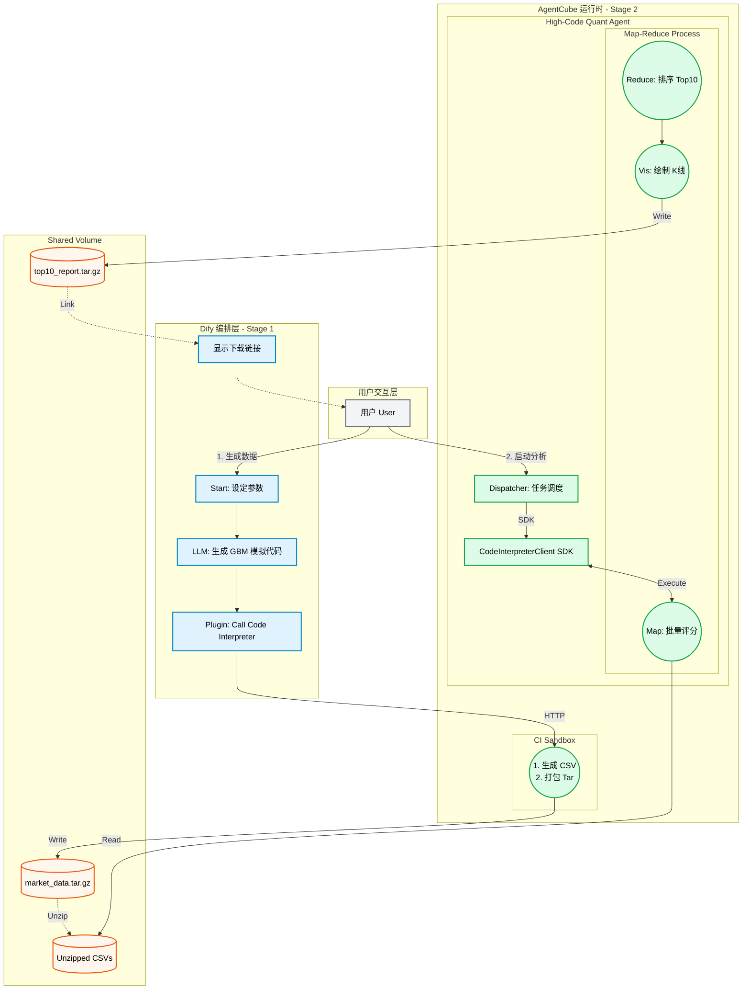
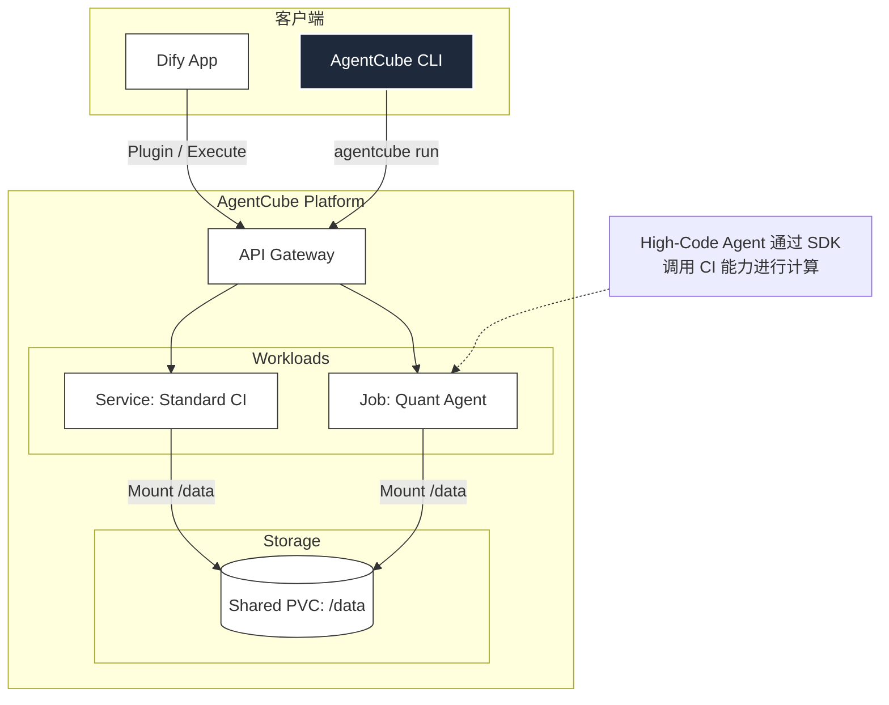
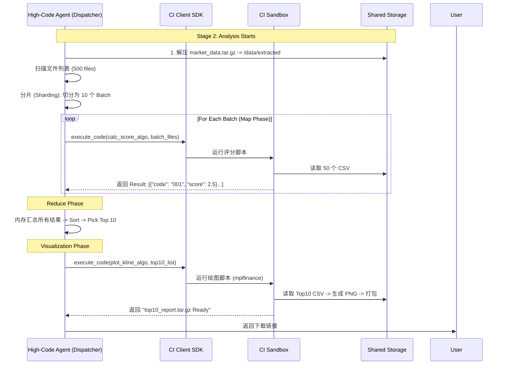

# 系统设计文档：分布式金融仿真与高阶分析平台

## 1. 系统动机 (System Motivation)

本系统旨在通过一个复杂的金融场景，全方位展示 **AgentCube** 作为云原生 AI Agent 平台的关键能力：
1.  **AgentCube适配高、低代码框架场景**：展示 AgentCube可以适用于高代码及低代码场景，并可以混合编排。**Dify (低代码/自然语言)** 负责意图识别与任务分发，**AgentCube High-Code Agent (高代码/Python)** 负责复杂业务逻辑（如 Map-Reduce 调度）的完美协作。
2.  **高性能沙箱与 SDK**：体现 AgentCube 的毫秒级沙箱调度，以及通过 **CodeInterpreterClient SDK** 在代码中动态管控算力的能力。
3.  **全生命周期管理**：展示通过 `agentcube` 命令行工具 (CLI) 快速部署、配置持久化存储和管理常驻型 Agent。

---

## 2. 概要设计 (Summary Design)

系统架构分为 **控制面 (Dify)**、**数据面 (AgentCube Runtime)** 和 **存储面 (Shared Storage)**。

### 阶段一：数据工厂 (The Producer)
*   **控制端**：Dify 工作流。
*   **执行端**：**AgentCube Code Interpreter Service** (作为 Dify 插件)。
*   **任务**：
    1.  Dify 利用 LLM 生成 **几何布朗运动 (GBM)** 算法代码。
    2.  AgentCube CI 在沙箱中并发生成 500+ 股票的 OHLCV 数据 (CSV)。
    3.  打包为 `market_data.tar.gz` 并写入共享存储 `/data`。

### 阶段二：高阶分析 (The High-Code Analyst)
*   **控制端**：**High-Code Agent** (通过 CLI 部署的常驻服务)。
*   **架构模式**：**Map-Reduce (分治-归并)**。
*   **任务**：
    1.  **Map (分片计算)**：Agent 使用 SDK 调度 CI 沙箱，批量计算每只股票的 **动量-波动率评分**。
    2.  **Reduce (归并排序)**：Agent 汇总所有分数，排序选出 **Top 10**。
    3.  **Visualize (可视化)**：Agent 再次调用 CI，为 Top 10 绘制 K 线图并打包 `top10_report.tar.gz`。

---

## 3. 架构图表 (Architecture Diagrams)

### 3.1 核心流程图 (Flowchart)



### 3.2 组件部署图 (Component Diagram)



### 3.3 Map-Reduce 时序图 (Sequence Diagram)



---

## 4. 详细实现设计 (Implementation Details)

### 4.1 Dify 端：数据生成算法 (GBM)

**目标**：生成逼真的 OHLCV 数据。
**Dify Prompt**：
> "编写 Python 代码，使用几何布朗运动 (GBM) 生成 500 只股票一年的分钟/日线数据。
> 1. 每只股票随机分配不同的 Drift (漂移率) 和 Volatility (波动率)。
> 2. 确保 High >= Max(Open, Close), Low <= Min(Open, Close)。
> 3. 保存为 `/data/raw/STK_{id}.csv`。
> 4. 最后打包为 `/data/market_data.tar.gz`。"

```csv
Date,Open,High,Low,Close,Volume
2024-01-01,100.00,102.50,99.80,101.20,1500000
2024-01-02,101.20,103.10,100.50,102.80,1650000
```

### 4.2 AgentCube 基础设施：CLI 部署

使用 `agentcube` 命令行部署 High-Code Agent，并挂载共享存储。

### 4.3 High-Code Agent 核心逻辑 (Python)

Agent 内部集成 SDK，实现 **Map-Reduce** 逻辑。

**代码结构**：

```python
import os
import tarfile
import json
from agentcube import CodeInterpreterClient 

# --- 算法定义 (发送给沙箱执行的代码片段) ---

# Map 算法: 计算评分
ALGO_MAP_SCORE = """
import pandas as pd
import os

def calculate_batch(file_list):
    results = []
    for fname in file_list:
        try:
            path = os.path.join('/data/extracted', fname)
            df = pd.read_csv(path)
            if len(df) < 30: continue
            
            # 1. 动量 (Momentum): (P_now - P_30ago) / P_30ago
            closes = df['Close'].values
            mom = (closes[-1] - closes[-30]) / closes[-30]
            
            # 2. 波动率 (Volatility): std(pct_change)
            vol = df['Close'].pct_change().tail(30).std()
            if vol == 0: vol = 1e-6
            
            # 3. 评分公式: High Return, Low Risk
            score = (mom * 0.7) - (vol * 0.3)
            
            results.append({"code": fname.replace(".csv",""), "score": score})
        except: continue
    return results

# 这里的 batch_files 变量由 SDK 注入或替换
print(json.dumps(calculate_batch({BATCH_FILES})))
"""

# Visualize 算法: 绘图
ALGO_VISUALIZE = """
import mplfinance as mpf
import pandas as pd
import tarfile
import os

top_codes = {TOP_10_LIST}
os.makedirs('/data/result', exist_ok=True)

for code in top_codes:
    try:
        df = pd.read_csv(f'/data/extracted/{code}.csv', index_col=0, parse_dates=True)
        # 绘制蜡烛图 + 均线
        mpf.plot(df.tail(60), type='candle', mav=(5,10), 
                 title=f'{code} - Strong Buy',
                 savefig=f'/data/result/{code}.png')
    except: continue

with tarfile.open('/data/top10_report.tar.gz', 'w:gz') as tar:
    tar.add('/data/result', arcname='charts')
print("Charts Generated.")
"""

# --- 主程序 (运行在 High-Code Agent 容器中) ---

def main():
    # 1. 初始化 Client
    client = CodeInterpreterClient(name="quant-session", ttl=3600, verbose=True)
    
    # 2. 准备数据 (解压)
    # 假设 Agent 容器直接挂载了 /data，可以直接解压，或者让 CI 解压
    if not os.path.exists('/data/extracted'):
        with tarfile.open('/data/market_data.tar.gz', 'r:gz') as tar:
            tar.extractall('/data/extracted')
            
    # 3. Sharding (分片)
    all_files = [f for f in os.listdir('/data/extracted') if f.endswith('.csv')]
    BATCH_SIZE = 50
    batches = [all_files[i:i + BATCH_SIZE] for i in range(0, len(all_files), BATCH_SIZE)]
    
    print(f"Starting Map-Reduce on {len(all_files)} files in {len(batches)} batches...")
    
    # 4. Map Phase (串行或并行调用 SDK)
    all_results = []
    for batch in batches:
        # 动态注入文件列表
        code = ALGO_MAP_SCORE.replace("{BATCH_FILES}", str(batch))
        res = client.execute_code(code)
        
        # 解析结果 (假设 stdout 是 JSON)
        try:
            batch_data = json.loads(res.stdout)
            all_results.extend(batch_data)
        except:
            print(f"Error parsing batch result: {res.stderr}")

    # 5. Reduce Phase (本地内存排序)
    # 按 score 降序
    all_results.sort(key=lambda x: x['score'], reverse=True)
    top_10 = all_results[:10]
    top_10_codes = [x['code'] for x in top_10]
    
    print(f"Top 10 Stocks: {top_10_codes}")
    
    # 6. Visualization Phase
    vis_code = ALGO_VISUALIZE.replace("{TOP_10_LIST}", str(top_10_codes))
    client.execute_code(vis_code)
    
    print("Mission Complete. Result at /data/top10_report.tar.gz")

if __name__ == "__main__":
    main()
```